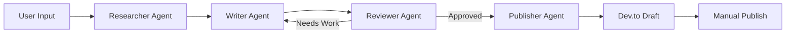
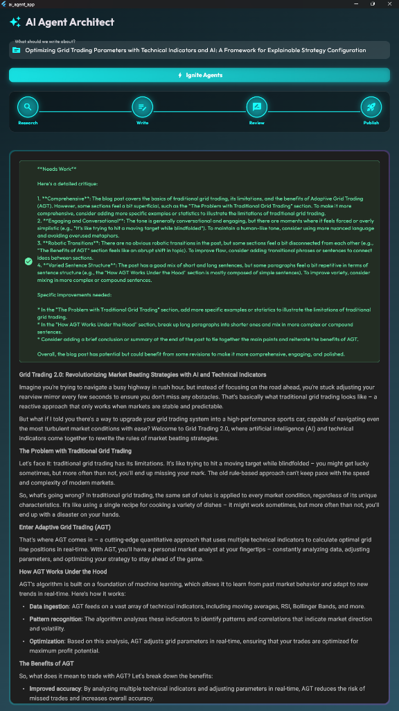

<div align="center">

# 🤖 Multi-AI Agent Blog Generator

[](https://www.python.org/)
[](https://flutter.dev/)
[](https://github.com/langchain-ai/langgraph)
[](https://ollama.ai/)
[](https://dev.to/rcids)

*An intelligent multi-agent system that researches, writes, reviews, and publishes tech blog posts automatically*

[🚀 Features](#-features) • [🏗️ Architecture](#️-architecture) • [⚡ Quick Start](#-quick-start) • [📱 Screenshots](#-screenshots)

---

</div>

## 🌟 Overview

This project showcases a **production-ready multi-agent AI system** built with **LangGraph** that automates the entire blog creation workflow. From research to publication on Dev.to, four specialized AI agents collaborate seamlessly to produce high-quality, humanized tech content.

**Built by:** [Rcids](https://dev.to/rcids) | **Live Example:** [My Dev.to Profile](https://dev.to/rcids)

## ✨ Features

🔍 **Intelligent Research Agent**
- Powered by DuckDuckGo Search API
- Gathers latest tech news and insights
- Contextual information extraction

✍️ **Human-like Writer Agent**
- Uses Llama 3.1 via Ollama
- Conversational, engaging tone
- Avoids robotic AI patterns

🧐 **Quality Reviewer Agent**
- Multi-criteria evaluation
- Detects AI-like language
- Iterative improvement loop (max 3 revisions)

🚀 **Auto-Publisher Agent**
- One-click publishing to Dev.to
- Draft mode for safety
- Manual override option

🎨 **Modern Flutter UI**
- Animated process visualization
- Dark theme with gradients
- Real-time stage tracking
- Responsive design (Windows/Web/Mobile)

## 🏗️ Architecture



**Tech Stack:**
- **Backend:** FastAPI, LangGraph, LangChain
- **LLM:** Llama 3.1 (via Ollama)
- **Frontend:** Flutter (Windows/Web/Mobile)
- **Publishing:** Dev.to API

## ⚡ Quick Start

### Prerequisites
- Python 3.8+
- Flutter SDK
- Ollama with Llama 3.1
- Dev.to API Key

### 🐍 Backend Setup

1. **Clone the repository**
```bash
git clone https://github.com/Rcidshacker/Multi-AI-Agent.git
cd Multi-AI-Agent
```

2. **Create virtual environment**
```bash
python -m venv ai_agents_env
# Windows
.\ai_agents_env\Scripts\activate
# macOS/Linux
source ai_agents_env/bin/activate
```

3. **Install dependencies**
```bash
pip install -r requirements.txt
```

4. **Install Ollama and pull Llama 3.1**
```bash
# Install from https://ollama.ai
ollama pull llama3.1:latest
```

5. **Get Dev.to API Key**
- Go to [Dev.to Settings](https://dev.to/settings/extensions)
- Generate API Key
- Update `publisher.py` with your key

6. **Run the server**
```bash
python -m uvicorn server:app --host 127.0.0.1 --port 8000
```

### 📱 Flutter App Setup

1. **Navigate to app directory**
```bash
cd ai_agent_app
```

2. **Get dependencies**
```bash
flutter pub get
```

3. **Run the app**
```bash
# For Windows
flutter run -d windows

# For Web
flutter run -d chrome

# For Android (using emulator)
flutter run
```

## 📱 Screenshots

### Main Interface


*Clean, modern UI with gradient backgrounds and smooth animations*

### Workflow Visualization
The app displays real-time progress through 4 stages:
1. 🔎 **Research** - Gathering information
2. ✍️ **Write** - Generating content
3. 🧐 **Review** - Quality check
4. 🚀 **Publish** - Sending to Dev.to

## 🎯 How It Works

1. **Enter a topic** in the Flutter app (e.g., "The Future of Quantum Computing")
2. **Click "Ignite Agents"** to start the workflow
3. **Watch the magic:**
   - Researcher finds latest info
   - Writer creates engaging draft
   - Reviewer checks quality (loops if needed)
   - Publisher sends to Dev.to
4. **Manual override:** Click "Publish to Dev.to" if you want to publish even if reviewer requested changes

## 🛠️ Project Structure

```
Multi-AI-Agent/
├── ai_agent_app/          # Flutter frontend
│   ├── lib/
│   │   ├── main.dart      # Main app
│   │   └── widgets/       # Custom widgets
│   └── pubspec.yaml
├── main.py                # Core agent logic
├── server.py              # FastAPI backend
├── publisher.py           # Dev.to publishing
└── requirements.txt       # Python dependencies
```

## 🔧 Configuration

### API Keys
Update `publisher.py` with your Dev.to API key:
```python
API_KEY = "your_dev_to_api_key_here"
```

### Backend URL (for mobile)
In `ai_agent_app/lib/main.dart`, update for Android emulator:
```dart
String baseUrl = Platform.isAndroid 
    ? "http://10.0.2.2:8000"  // Android emulator
    : "http://127.0.0.1:8000"; // Desktop/Web
```

## 🚀 Features in Action

### Humanized Content
The Writer Agent is specifically prompted to:
- Use conversational language
- Avoid AI clichés like "Moreover" and "In conclusion"
- Include rhetorical questions
- Vary sentence structure
- Show personality

### Quality Control
The Reviewer Agent checks for:
- Comprehensiveness
- Human-like tone
- Robotic transitions (flags them)
- Varied sentence structure

### Auto-Publishing
- Posts are created as **drafts** by default
- Manual publish button for override
- URL displayed after successful publish

## 🤝 Contributing

Contributions are welcome! This project demonstrates:
- ✅ Multi-agent orchestration with LangGraph
- ✅ State management in AI workflows
- ✅ RESTful API design with FastAPI
- ✅ Modern Flutter UI development
- ✅ External API integration (Dev.to)
- ✅ Conditional workflow routing

## 📄 License

MIT License - feel free to use this project as a portfolio piece or learning resource!

## 🌐 Connect

**Author:** Rcids  
**Dev.to:** [https://dev.to/rcids](https://dev.to/rcids)  
**GitHub:** [https://github.com/Rcidshacker](https://github.com/Rcidshacker)

---

<div align="center">

**⭐ Star this repo if you find it helpful!**

Made with ❤️ using LangGraph, Llama 3.1, and Flutter

</div>
